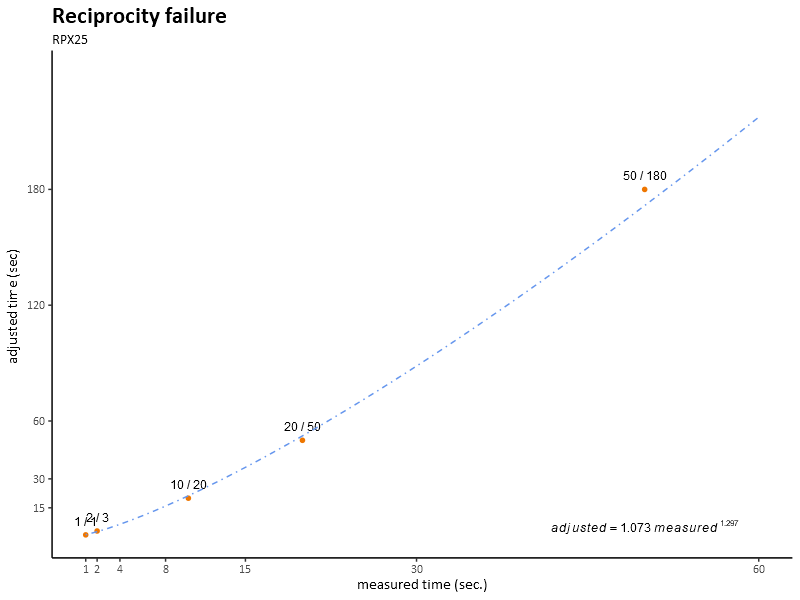

# Reciprocity

[Reciprocity failure](https://en.wikipedia.org/wiki/Reciprocity_(photography)), also called Schwarzschild effect, is a well known feature of film photography. For exposure times between 1/1,000 of a second and 1 second a simple relationship applies: $$exposure\: value = light\:intensity * exposure\:time$$
This relationship is used by photographers to determine camera settings (aperture and exposure time) for a given level of illumination.

For exposure times longer than 1 second this simple relationship breaks down, and the exposure time measured with a light meter needs to be adjusted upwards (for correct exposition a longer than expected exposure time is necessary). This adjustment for breakdown of the law of reciprocity is differs between various film emulsions, and a number of conversion tables are provided by the film manufacturers.

I was not satisfied with the published data - some manufacturers quote only as feq as  [three data points](http://www.foma.cz/en/fomapan-100) - which I found inadequate for my photography needs.

I have therefore created a simple project, which uses R to estimate a more general function for the film reciprocity failure, display a chart and interpolate a table of adjusted times for exposure values (½ EV steps from one second to two minutes). 

The project uses log - log transformation to linearize power law function - formula: $$ adjusted = a * measured ^ b $$ Where a and b are parameters specific to film emulsion used (and the main ouputs of my regression).

I have found this function to deliver the closest match to reported data of all simple functions, and later discovered it was the the type of function Karl Schwarzschild used all those years ago.

